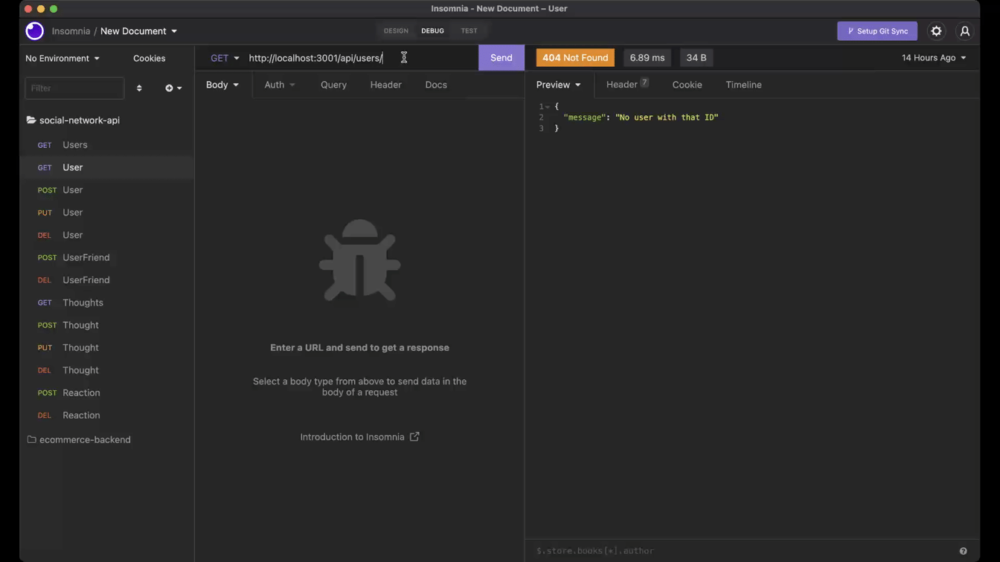
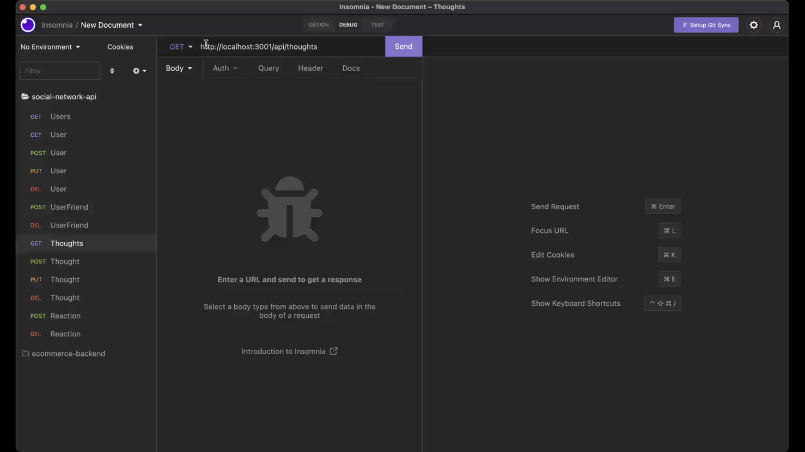

# Social Network API
[](https://opensource.org/licenses/MIT)

## Description
This social network api allows users to share their thoughts, react to friends' thoughts and create a friend list. The application uses Expresss.js for routing, a MongoDB database and the Mongoose ODM. In addition to using the Express.js and Mongoose packages, the app also uses the native JavaScript Date object to format timestamps.

## Installation
The following will be a guide about installing the application and getting it to run once completed
- Start by forking the repository 
- Next perform a npm install
```
npm install 
```
- Then, seed the database
```
npm run seed
```
- Once that is all completed, in the terminal start the server
```
npm start
```

## Usage (GIFs Demo)

### To start the application:


### To get all users (GET Route):


### To create a user (POST Route):


### To get one user by ID (GET Route):


### To update a user by ID (PUT Route):


### To delete a user by ID (DELETE Route):


### To get all thoughts (GET Route):


### To create a thought (POST Route):


### To get one thought by ID (GET Route):


### To update a thought by ID (PUT Route):


### To delete a thought by ID (DELETE Route):


### To add a friend to a user (POST Route):


### To delete a friend to a user (DELETE Route):


### To add a reaction to a thought (POST Route):


### To delete a reaction to a thought (DELETE Route):


## Technology Used
| Library/Packages|
| ------------- |
| | 
| |
| Mongoose|
| JavaScript Data|

## License
[](https://opensource.org/licenses/MIT)

Copyright (c) 2022 Kristy Guo

Permission is hereby granted, free of charge, to any person obtaining a copy
of this software and associated documentation files (the "Software"), to deal
in the Software without restriction, including without limitation the rights
to use, copy, modify, merge, publish, distribute, sublicense, and/or sell
copies of the Software, and to permit persons to whom the Software is
furnished to do so, subject to the following conditions:

The above copyright notice and this permission notice shall be included in all
copies or substantial portions of the Software.

THE SOFTWARE IS PROVIDED "AS IS", WITHOUT WARRANTY OF ANY KIND, EXPRESS OR
IMPLIED, INCLUDING BUT NOT LIMITED TO THE WARRANTIES OF MERCHANTABILITY,
FITNESS FOR A PARTICULAR PURPOSE AND NONINFRINGEMENT. IN NO EVENT SHALL THE
AUTHORS OR COPYRIGHT HOLDERS BE LIABLE FOR ANY CLAIM, DAMAGES OR OTHER
LIABILITY, WHETHER IN AN ACTION OF CONTRACT, TORT OR OTHERWISE, ARISING FROM,
OUT OF OR IN CONNECTION WITH THE SOFTWARE OR THE USE OR OTHER DEALINGS IN THE
SOFTWARE.

